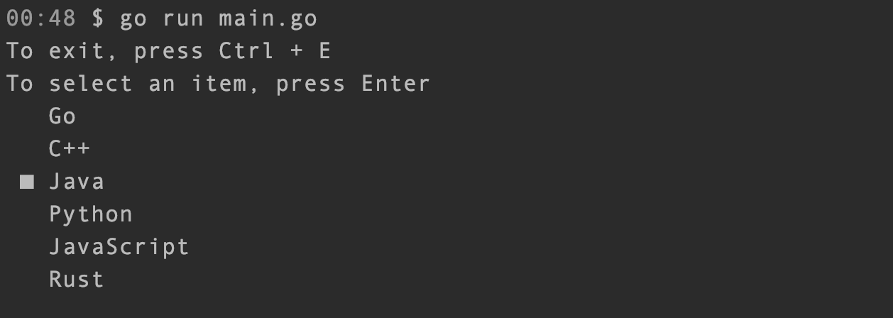

# app
Reusable framework for Go apps & command line tools

## Features

`app` abstracts out each component of the framework, allowing you to swap out any part at any time you want without changing the rest of your application.

Currently `app` provides the following components:

- HTTP router
- GraphQL
- GRPC
- Database
  - Driver
  - Schema & data migration
- Environmental variables
  - Easy retrieving
  - Automatically load `.env` file when presents
- JWT
  - encoding
  - decoding
- TLS
- Timer
- Logger
- Tracer
- Terminal GUI

`app` also includes convenient helpers to facilitate automated testing.

### To be supported

- Service registry
- Message queue
- Cache Driver

## Projects using `app`

- [Short](https://github.com/byliuyang/short): URL shortening service
  
  

- [Kgs](https://github.com/byliuyang/kgs): Distributed Key Generation Service


### CLI


### Building your own application

Dependency injection is recommended to make your app easy to change and testable. [wire](https://github.com/google/wire) is a compile time dependency injection framework for Go apps. Here is the example usage:

```go
//+build wireinject
var authSet = wire.NewSet(
	provider.JwtGo,

	wire.Value(provider.TokenValidDuration(oneDay)),
	provider.Authenticator,
)

var observabilitySet = wire.NewSet(
	mdlogger.NewLocal,
	mdtracer.NewLocal,
)

func InjectGraphQlService(
	name string,
	sqlDB *sql.DB,
	graphqlPath provider.GraphQlPath,
	secret provider.ReCaptchaSecret,
	jwtSecret provider.JwtSecret,
) mdservice.Service {
	wire.Build(
		wire.Bind(new(fw.GraphQlAPI), new(graphql.Short)),
		wire.Bind(new(url.Retriever), new(url.RetrieverPersist)),
		wire.Bind(new(url.Creator), new(url.CreatorPersist)),
		wire.Bind(new(repo.UserURLRelation), new(db.UserURLRelationSQL)),
		wire.Bind(new(repo.URL), new(*db.URLSql)),

		observabilitySet,
		authSet,

		mdservice.New,
		provider.GraphGophers,
		mdhttp.NewClient,
		mdrequest.NewHTTP,
		mdtimer.NewTimer,

		db.NewURLSql,
		db.NewUserURLRelationSQL,
		keygen.NewInMemory,
		url.NewRetrieverPersist,
		url.NewCreatorPersist,
		provider.ReCaptchaService,
		requester.NewVerifier,
		graphql.NewShort,
	)
	return mdservice.Service{}
}
```

The following code will be generated after running `wire` command:

```go
func InjectGraphQlService(name string, sqlDB *sql.DB, graphqlPath provider.GraphQlPath, secret provider.ReCaptchaSecret, jwtSecret provider.JwtSecret) mdservice.Service {
	logger := mdlogger.NewLocal()
	tracer := mdtracer.NewLocal()
	urlSql := db.NewURLSql(sqlDB)
	retrieverPersist := url.NewRetrieverPersist(urlSql)
	userURLRelationSQL := db.NewUserURLRelationSQL(sqlDB)
	keyGenerator := keygen.NewInMemory()
	creatorPersist := url.NewCreatorPersist(urlSql, userURLRelationSQL, keyGenerator)
	client := mdhttp.NewClient()
	httpRequest := mdrequest.NewHTTP(client)
	reCaptcha := provider.ReCaptchaService(httpRequest, secret)
	verifier := requester.NewVerifier(reCaptcha)
	cryptoTokenizer := provider.JwtGo(jwtSecret)
	timer := mdtimer.NewTimer()
	tokenValidDuration := _wireTokenValidDurationValue
	authenticator := provider.Authenticator(cryptoTokenizer, timer, tokenValidDuration)
	short := graphql.NewShort(logger, tracer, retrieverPersist, creatorPersist, verifier, authenticator)
	server := provider.GraphGophers(graphqlPath, logger, tracer, short)
	service := mdservice.New(name, server, logger)
	return service
}
```

## Author
Harry Liu - [byliuyang](https://github.com/byliuyang)

## License
This project is maintained under MIT license